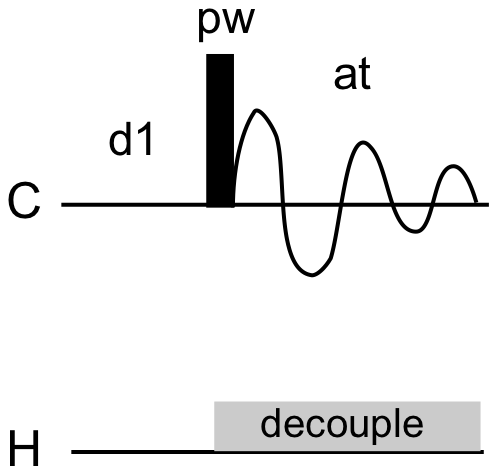
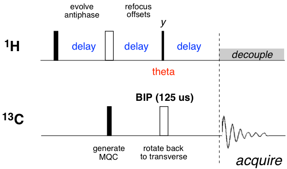
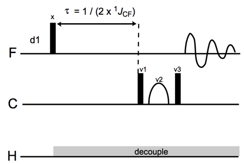
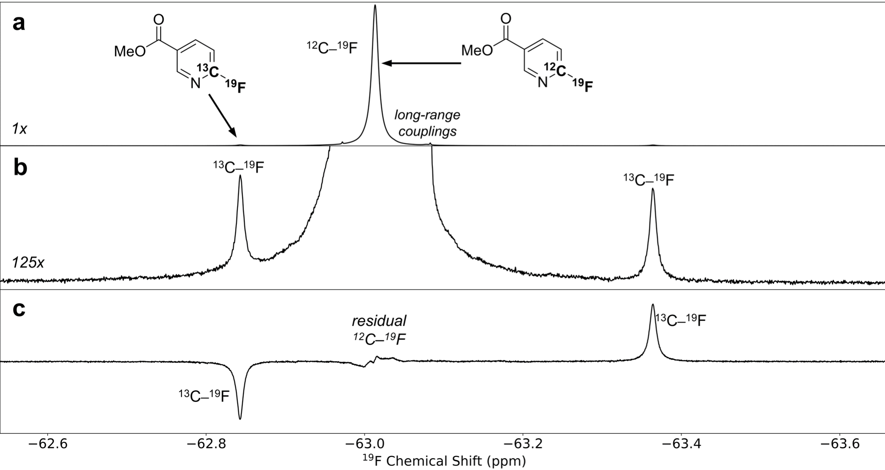

# Data Acquisition

*How to set up the NMR experiments.*

## Contents

Introduction | [Overview](#overview) | [Installation](../README.md#installation)
--- | --- | ---
**Experiments** | [Spectrometer Setup](#spectrometer-setup) | [Quantitative <sup>13</sup>C NMR](#quantitative-13c-nmr)
&nbsp; | [DEPT](#dept) | [MQF](#mqf)

*Note: The [Overview](#overview) section describes how the NMR experiments should be set up in general.  The later sections give instructions that are specific to Varian/Agilent NMR systems.  Please contact us if you wish to adapt these experiments for other systems.*

## Overview

The general procedure for acquiring NMR data involves several steps:

  * *Pulse Sequence Installation*

    Some experiments (e.g., quantitative <sup>13</sup>C NMR or DEPT) usually come pre-installed.  Others (e.g., MQF) will need to be [installed](../README.md#installation).

  * *Spectrometer Calibration*

	 These routine steps should performed according to your manufacturer's instructions:

    * Locking
    * Shimming
    * Probe Tuning
    * Pulse Width Calibration
    
    Please consult with your facility manager before starting your experiment.

  * *Experiment-Specific Steps*

    Some experiments will require additional calibrations.  For example, DEPT will require that broadband inversion pulses (BIPs) be calibrated beforehand.  Please see the later sections for details.
    
  * *Data Acquisition*

    Most acquisitions will require at least two different NMR experiments (one for <sup>13</sup>C and another for <sup>12</sup>C).  Our standard practice is to interleave the experiments as <sup>13</sup>C&ndash;<sup>12</sup>C&ndash;<sup>13</sup>C.  This procedure should be repeated for each sample, with [randomized blocking](../README.md#error-analysis) implemented as necessary.

## Spectrometer Setup

*The following assumes you are using VNMRJ version 3 or later.*

  * **Locking**

    A stable lock is essential for spectrometer stability in long experiments.
  
  * **Shimming**

    Good lineshape is very helpful for making precise integrations.  We use routine z-gradient shimming, followed by limited xy-shimming.  To adjust the xy-shims, select `Tools...Standard Calibration Experiments...Shim Editor`.  Under `Current Method`, select `xyz_basic` and press `Start Shimming`.
  
  * **Spinning**

    <u>Spinning should be turned **OFF** for all experiments.</u>  Spinning causes artifacts that interfere with good integration.
  
  `spin=0 su`   
  
  * **Probe Tuning**

    It is important to tune all the channels that will be used in the experiment.  If you have auto-tune capability, please use it.
  
  * **Pulse Width Calibration**

    Please note that not all of the pulses used in the experiments described below operate at the same transmitter power.  Generally, pulses will need to be calibrated at their intended power.  (This includes decoupling pulses.)
  
    We follow the usual procedure for pulse calibrations: 
  
    * set `tpwr` to the desired power (in dB)
    * select an arbitrary peak in the spectrum and set it on-resonance with `movetof`
    * set `pw` to the approximate 90&deg; pulse width
    * acquire and phase the peak to positive absorption (i.e., "up")
    * Quadruple `pw` to locate the 360&deg; pulse width (`pw=pw*4`).  If the peak is negative, the value is too low; if the peak is positive, the value is too high.
    * Divide the `pw` that gives an approximate null by 4 to obtain the 90&deg; pulse width at `tpwr`.

    If necessary, it can be helpful to increase the vertical position of the spectrum (e.g., `vp=60`) so it is easier to see negative peaks.
  
    Once a pulse width is available at one power for a given nucleus, it is much easier to determine pulse widths at other power levels.  This [online calculator](http://sbtools.uchc.edu/nmr/pw_calculator/) can be very helpful.

  * **Measuring T<sub>1</sub> with Inversion Recovery**

    It is good practice to check the T<sub>1</sub> times for each sample using inversion recovery.  This experiment is available from the `Experiments` menu.
    * Ensure that the correct nucleus has been selected and the pulse width has been calibrated at the power level of the experiment.  Ensure `pw90` is set correctly and type `p1=2*pw90` and `pw=pw90`.
    * In the `Acquire` tab, set your minimum and maximum T<sub>1</sub> times.  (These can be guesses.  If your guesses are wrong, you can simply adjust these values and repeat the experiment.)
    * Set the number of scans to 1 and the number of steady state scans to zero.
    * Acquire.
    * When the experiment is finished, zoom in on the peak of interest and click on `T1 analysis` in the `Process` tab.  You may need to adjust the peak threshold to capture the peak of interest.

  * **Relaxation Time**

    All experiments described here are designed to work with systems that are fully at spin equilibrium before each scan.  Our practice is to use delay times (`d1`) of at least 5xT<sub>1</sub>.
  
  (In principle, shorter times may be used.  Errors will be incurred to the extent that different samples have different T<sub>1</sub>s.  However, with the use of Cr(acac)<sub>3</sub>, this shouldn't occur.)

  * **Spectral Window**

	 To set the spectral window, left-click once on the spectrum to define the left edge of the window and right click again to define the right edge of the window.  Set the window with the `movesw` command.

    * *Center*

      The center of the window is defined by the transmitter offset (`tof`).  To move the center of the window, click on the desired location and type `movetof`.  The center of the spectrum should be set to the middle of the range of interesting peaks (or on the peak of interest).

    * *Width*

      The spectral window (`sw`) should be at least 20% wider than the range of interesting peaks.  Note that peaks that appear just outside the spectral window can alias into the spectrum, so use a wider width if in doubt.

  * **Number of Points**

    Collect as many points as are needed to collect the entire decay of the FID.  To display the FID, use the `df` command.  We typically round up the number of points (`np`) to the next power of 2.

## Quantitative <sup>13</sup>C NMR



Quantitative <sup>13</sup>C NMR is simply a pulse-acquire experiment with special decoupling.  As with all the other experiments, the delay between scans (`d1`) is set to at least 5T<sub>1</sub>.  Because carbons have very long T<sub>1</sub> times, these repetition delays can be substantial (minutes).

In particular, carbons that have no attached protons tend to relax very slowly (because the dipolar mechanism is very inefficient).  Nonetheless, quantitative <sup>13</sup>C NMR is the only method at present that can measure KIEs at such "quaternary" carbons (just be prepared to wait!).  For all other applications, DEPT is more sensitive and much faster.

* **Nuclear Overhauser Effect (NOE)**

  In routine carbon spectra, proton decoupling is always on: between scans, while pulsing, and during acquisition.  In VNMRJ syntax, the "decoupler mode" `dm='yyy'`.  Decoupling between scans helps the NOE reach a high steady state level, resulting in enhanced S/N.  However, this is counterproductive for quantitative applications because the NOE depends on various factors like relaxation time that may not be well-controlled between samples.  (It has been suggested that this requirement may be relaxed in some cases, but the DEPT procedure makes this unnecessary.)
  
  In quantitative <sup>13</sup>C NMR, "inverse gated decoupling" is used to minimize the development of NOE, but retain the singlet structure of each peak.  To do this, <u>set `dm='nny'`</u>.

* **Proton Decoupling**

  The decoupling can be set through the `Channels` tab, or through these parameters:
  
  * `dn`, the decoupler nucleus.  Set to `H1`.
  * `dof`, the decoupler offset.  Set to the middle of the proton spectrum.
  * `dpwr`, the decoupler power.  We have found that using the maximum feasible power (48 dB) is best.
  * `dmf`, the decoupler modulation frequency.  Set to 1/pw90 at the decoupler power.
  * `dm`, the decoupler mode.  Set to `nny` as discussed above.
  * `dmm`, the decoupler modulation mode.  Set to `w` for WALTZ-16.
  * `dres`, the decoupling resolution.  Set to `90` for WALTZ-16.

  Once these settings have been input, you can use the `dmfadj` macro to adjust `dmf` so that an integer number of decoupling cycles completes for each acquisition.  You can also use `dps` to display the pulse sequence, which should reflect your choice of `dm`.

* **Fluorine Decoupling**

  For some fluorine-containing compounds, it is essentially mandatory to decouple proton and fluorine simultaneously to achieve adequate S/N.  (Note that this requires a triple-channel probe and instrument.)  To setup fluorine decoupling, you must first generate the composite decoupling shape:
  
  * Acquire a routine fluorine spectrum that encompasses the fluorines to be decoupled.
  * Set the cursors to bound the region to be decoupled.
  * Open the `pbox` tool window from the `Edit` menu.
  * Select `new waveform`.
  * Select `decoupling` under `shape type`.
  * Set the `shape name` to `CHIRP`.
  * Select `select from spectrum` to set the bandwidth from the cursors.
  * Set the `pulse length` to 1/5J, where J is the largest carbon-fluorine coupling constant to be decoupled.
  * Click `add waveform`.
  * Enter a name in the `shape file name` box.
  * Press `make it` to generate the composite decoupling pulse.
  * Your decoupling file (`.DEC`) will be written to `~/vnmrsys/shapelib`.  Open this file to determine which decoupling power and modulation frequency should be used in the next set of steps.
  
  (It is generally useful to have calibrated the fluorine pulse width near the decoupling power that will be used.)
  
  Now set the decoupler parameters on the third channel (easiest way is to enter these on the Channels tab):
  
  * Set `dn2='F19'`.
  * Set `dof2` to the frequency of the fluorine of interest.
  * Set `dpwr2` and `dmf2` to the values from the `.DEC` file.
  * Set `dm2='nny'`.
  * `dmm2`, the decoupler modulation mode.  Set to `ccp` to request the "programmable" sequence.
  * `dres2`, the decoupling resolution.  Set to `9` degrees for CHIRP.
  * Set `dseq2` to the name of the decoupling file (without `.DEC`).
  
  It is a very good idea to test this out before acquiring a full set of spectra!

## DEPT

DEPT stands for "distortionless enhancement by polarization transfer."  DEPT has long been used to assign the multiplicity of peaks in <sup>13</sup>C NMR spectra for natural products elucidation.  (Multiplicity = CH, CH<sub>2</sub>, or CH<sub>3</sub>.)

DEPT is a good method for measuring the KIEs at protonated carbons.  The wide chemical shift range of <sup>13</sup>C makes it unlikely that any peaks will overlap.  Because these spectra are proton-decoupled, all peaks appear as singlets, which maximizes S/N.  The expected sensitivity gain is approximately a factor of 4, with some gains coming from the lower relaxation time of <sup>1</sup>H vs. <sup>13</sup>C.

* **Basis for DEPT**

  The basic idea behind DEPT is to generate the signal on <sup>1</sup>H and then use "polarization transfer" to detect the signal on <sup>13</sup>C.  (The increase in sensitivity has to do with the increased gyromagnetic ratio, &gamma;, of <sup>1</sup>H vs. <sup>13</sup>C.  This translates to a larger &alpha; vs. &beta; spin population and hence, more signal.)  

* **DEPT Parameters**

  The DEPT pulse sequence is:

  
<p><sup>**black** pulses: 90&deg; unless otherwise specified; white pulses: 180&deg;; all phases = x unless otherwise specified</sup></p>

  The key parameters are the blue delay (termed `delta` in the Python notebook described in the next section) and the tip angle of the read pulse (red).
  
  * The delay is determined by the value of `j1xh`.  Nominally,  `j1xh` = 1/(2.0 x <sup>1</sup>*J*<sub>CH</sub>). 
  * The tip angle, theta, is determined by the value of `mult`.  `mult=1` would give DEPT-90, which is the traditional way to get only methines (CHs).  Setting `mult=0.5` would give DEPT-45, and so forth.

  Although no one pair of values will be optimal for all peaks, a good compromise value is the average coupling constant and a tip angle of 55&deg;, or `mult=0.6111`.  (This works because <sup>1</sup>*J*<sub>CH</sub> generally decreases as multiplicity increases; for example, CH<sub>3</sub> groups typically have lower couping constants than CH groups.)
  
  If you want to squeeze more S/N out of your experiment, or you have peaks with unusual coupling constants, please read the next section.
  
* **Other DEPT Parameters**
  
  * Set `qphase=0` to suppress quaternary carbons.
  * Set `pplvl`, the proton power level, to 63 dB.
  * Set `pp`, the proton 90&deg; pulse width, to the value found from calibration (at 63 dB).
  * Set `dsp='i'` to turn on inline-oversampling.
  * Set `gain=60` for maximum gain.
  * Set `ss=0` to turn steady state scans off.  (Turn off any homospoil gradients as well.)

* **Response Factor Analysis**

  Because competitive KIE measurements inherently cancel out differences in response factors,<sup>[3](../README.md#references)</sup> the parameters in DEPT can be tuned to the peaks of interest.  We provide a [Python notebook](DEPT/response/DEPT_Response_Factor_Analysis.ipynb) that can calculate the optimal parameters for a given system.  Please see the notebook itself for instructions.
  
  * This notebook requires [`lmfit`](https://lmfit.github.io/lmfit-py/). 

* **BIP Calibration**

  The DEPT sequence requires carbon pulses that can invert the various coherences.  180&deg; pulses generally do not have the necessary bandwidth for good performance, so "broadband inversion pulses" (BIPs<sup>[6](../README.md#references)</sup)>) are generally used instead.  (Note that BIPs are generaly applied in pairs to prevent phase distortions.)
  
  For good phase performance in KIE measurements, it is a good idea to calibrate the BIP each time.  Because BIPs involve somewhat longer pulses, we generally reduce the transmitter power from the maximum value of 63 dB to 59 dB.  We provide an [`awk`](https://en.wikipedia.org/wiki/AWK) script for generating the requisite BIPs:
  
  * Calibrate the carbon pulse width at 59 dB.
  * Run the [`makeBIP.awk`](DEPT/BIP/makeBIP.awk) script:
  
    `awk -f makeBIP.awk bip.dat ref_pwr ref_pw90 | head`

  * `bip.dat` refers to the particular BIP to use.  Please refer to the original Shaka paper for details, but the numbers represent the bandwidth, inhomogeneity compensation, and duration of the pulses.  By default, you should use `75-15-140.dat`.
  * `ref_pwr` is the power level of the BIP pulse (59 dB).
  * `ref_pw90` is the 90&deg; pulse width at `ref_pwr` in &micro;s.

  This generates output like:
  
  ```
  # ========== Broadband Inversion Pulse (BIP) ==========
  # ref_pwr         =         59 dB
  # ref_pw90        =      18.00 us
  # spectr. freq.   =     125.00 MHz
  # B1_0            =      13.89 kHz = 111.1 ppm
  # BIP bandwidth   =      20.83 kHz = 166.7 ppm
  # inhomog. comp.  = +/-   2.08 kHz = 16.7 ppm
  # BIP length      =      108.0 us
  # number of steps =        216 steps
  # time/step       =       0.50 us
  # =====================================================
  ```
  
  * Verify that the BIP bandwidth is appropriate for the DEPT spectrum you are acquiring.
 
  * If you are satisifed, redirect the output to `~/vnmrsys/shapelib/whatever.RF`:
  
    `awk -f makeBIP.awk 75-15-140.dat 59 18 > ~/vnmrsys/shapelib/whatever.RF`
    
  * Enter the BIP length, power level, and shape name (in this example, `whatever`) into the DEPT parameters in the `Acquire...Pulse Sequence` tab.  Ensure "shaped pulse BB inversion" is turned on.  
  
* **Decoupling**

  The considerations for decoupling DEPT are the same as those for quantitative <sup>13</sup>C NMR.

* **Gradients**

  The DEPT sequence provided with the VNMRJ software typically includes gradients for the spin echoes.  We have not found these to be helpful.  To turn them off, set `gt5=0`.  Note that this parameter may be different depending on which sequence you use.  Use the `dps` command to verify that gradients are not being used.

* **Troubleshooting the Baseline**

  A flat baseline is very important for achieving high accuracy.  One of the factors influencing the baseline is how much first-order phase correction (`lp`) is necessary.  Recall that phase corrections multiply the complex spectrum by a linear function of the form `rp` + `lp` x frequency.  When `lp` is too large, the overall phase correction will cycle through 2&pi; multiple times, resulting in an oscillating baseline.
  
  One of the factors affecting `lp` is the "dead time" between the end of acquisition and the start of acquisition.  If acquisition does not start exactly when all the resonances are in phase, then each peak will get a different phase depending on its frequency.  This is precisely a first-order phase error and occurs because the signals must pass through a filter before they arrive at the detector.
  
  You can adjust `rof1`, `rof2`, and `alfa` to try to reduce this effect.  Acquire a test spectrum and use the `calfa` command.  (On newer consoles, consult the documentation regarding the `ddrtc` delay.)  Additionally, you should turn off any FID point shifting and backward linear prediction in processing.  (This makes it hard to see what the true effect of the delays is.)  To turn it off, go to the `Processing` tab and select `More 1D`.
  
  Even after all these steps, it is possible for the baseline not to be flat.  In such cases, apply the lowest-order polynomial correction that will correct the baseline.  It is also possible that standard phase correction will be unable to correct the phases of each peak completely.  In such cases, apply peak-by-peak phase correction as described in the processing tutorial.

## MQF

MQF is ideal for measuring KIEs of carbons bound to fluorine.  The sensitivity boost is over an order of magnitude.  In most cases of C&ndash;F KIEs, MQF is the method of choice.

The one drawback of MQF is that it cannot eliminate homonuclear fluorine-fluorine couplings.  In cases of very complex splitting, proton- and fluorine-decoupled DEPT may be a better option.  If you have such a case, please contact us.



* **How MQF Works**

  While the technical details of how this pulse sequence works are beyond the scope of this document, the general idea is simple.  The main goal is to quantify the amount of <sup>13</sup>C.  In principle, integrating the <sup>13</sup>C satellites in a fluorine spectrum would accomplish this (part **a** in the figure below).



  However, the parent <sup>12</sup>C&ndash;<sup>19</sup>F peak is so large it interferes with this (part **b**).  Thus, the goal of the MQF sequence is to suppress the undesired parent peak.  Once this is done, the satellites can be accurately integrated (part **c**).

* **Bandwidth**

  The methods described here assume that the fluorines of interest are within the excitation bandwidth of a full power pulse (approximately 1/pw90, or about 75 ppm under typical conditions).  It is possible to use shifted laminar pulses to overcome this limitation, but this technique is outside the scope of this document.  If you run into this problem, please contact us.

* **Carbon Decoupling**

  In principle, decoupling carbon would increase S/N by a factor of 2.  However, because cancellation of the parent <sup>12</sup>C&ndash;<sup>19</sup>F peak is imperfect, the decoupled satellite would be contaminated by a great deal of noise.  As a result, it is not helpful to decouple carbon.  In fact, the effect of having a carbon-13 present on the chemical shift of the <sup>19</sup>F moves one of the satellite peaks "out of the way," enabling clean integration.

## Acquiring Data

* **Arraying Scans**

  To reduce the uncertainty in the integration of each peak due to baseline noise, we average the integral over many scans.  To determine the uncertainty due to noise, we collect these scans in groups:
  
  * Standard <sup>1</sup>H, <sup>19</sup>F: 4 scans
  * DEPT, MQF: 32 scans

These numbers ensure that each group completes and entire phase cycle.  Keeping these numbers the same for all experiments allows for easy comparison of variance.  To collect groups of scans, use the `array` command.  For example, `array('nt',8,4,0)` would take 8 groups of 4 scans each.  Use the `time` command to display how long all scans will take.

* **Arraying Experiments**

  To create a schedule of experiments, use `jexp1`, `jexp2`, etc. to  move between the VNMRJ experiments.  You can copy an experiment from one place with another with `mf(m,n)`, where `m` is the number of the source experiment and `n` is the number of the destination experiment.
  
  Typing `ga` once an acquisition is already running will queue another experiment.  Use `explib` to see which experiment is currently running and which experiments are queued.

* **Block Size**

  The block size should be set to the number of scans in each group (see above).  We have found that setting the block size to a smaller number can sometimes lead to the loss of data!
