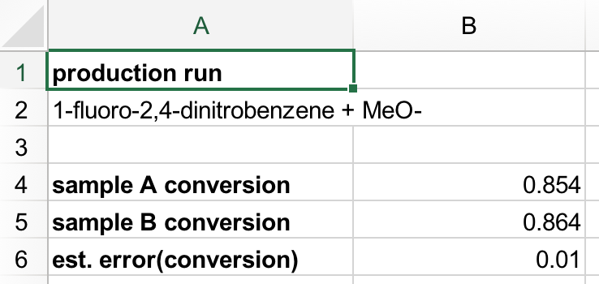
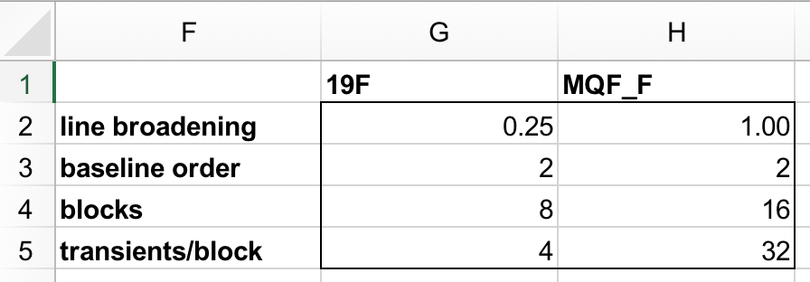
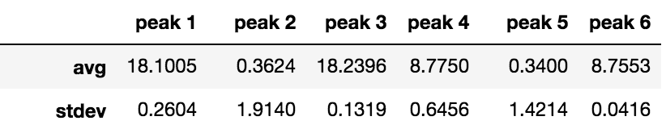
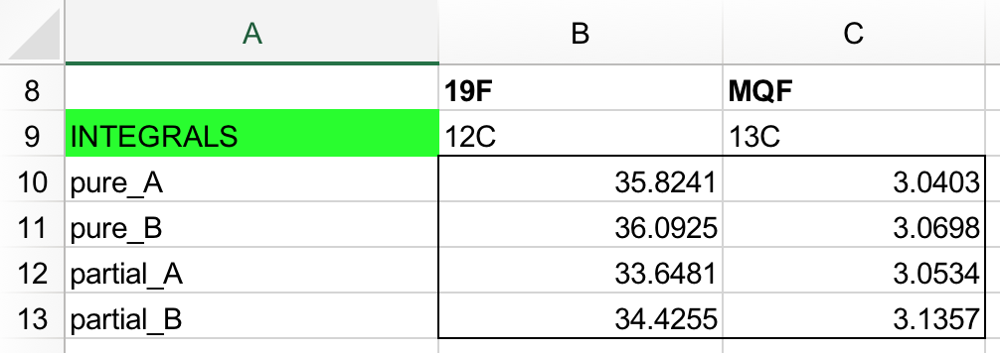
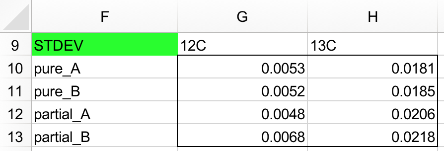
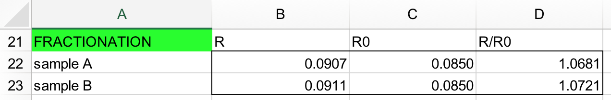
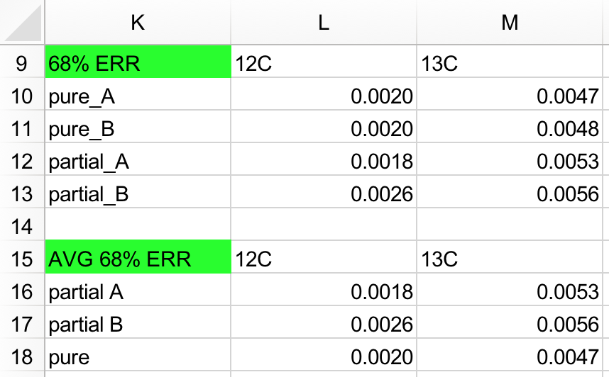
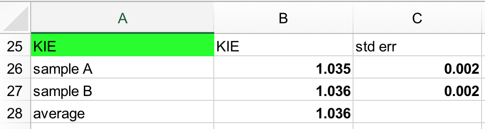

# Data Analysis

*Excel notebooks for calculating KIEs and error bars from NMR data.*

This directory contains a [completed example spreadsheet](Example_Spreadsheet.xlsx) and a [blank spreadsheet](Blank_Spreadsheet.xlsx) for the calculation of fractionation factors and KIEs.

Although we demonstrate a KIE calculation for a two replicate, one atomic center experimental design, the formulas used in this spreadsheet are general.  It should be straightforward to adapt the spreadsheet  to the number of samples and number of atomic centers in your particular system.

## Picking the Right Spreadsheet Tab

(We assume you have already acquired and processed the required NMR data.)

**Are you doing...**

* *Starting-Material-Based Analysis?*
  * Use the "SM Analysis KIE calculation" tab.
  * `pure_A`, `pure_B`: unreacted starting materials
  * `partial_A`, `partial_B`: recovered starting material at high conversion
  
* *Product-Based Analysis?*
  * Use the "Prod Analysis KIE calculation" tab.
  * `full_A`, `full_B`: product taken from reactions carried to full conversion
  * `partial_A`, `partial_B`: product taken from reactions carried to low conversion

(A and B refer to independent chemical replicates.)

## Tutorial

Below, we walk through the process of calculating the KIE for a nucleophilic aromatic substitution reaction (1-fluoro-2,4-dinitrobenzene + sodium methoxide) based on recovered starting material.

The example spreadsheet also contains data for a product-based analysis, but it will not be considered below (the methodology is completely analogous).

### Step 1: Enter Experimental Information

* `A2`: description of reaction
* `B4`,`B5`: what conversion were `partial_A` and `partial_B` taken to? (from 0&ndash;1)
* `B6`: estimated standard deviation in the conversion measurement

---

These values don't affect the notebook, but are good for record-keeping and interpretation of the results:

* `line broadening`: the `lb` parameter in the Jupyter notebook 
  (look for this line: `pdic, pdata = ng.pipe_proc.em(pdic, pdata, lb=0.25`)
* `baseline order`: what degree polynomial is being used to represent the baseline 
  (look for this line: `def compute_baseline(spectrum, order=2, ...`)
* `transients/block`: how many scans were averaged together to create one integral measurement (usually, one complete phase cycle)

This line affects the calculation of the uncertainty:

* `blocks`: how many collated measurements were made (for example, collecting `array('nt',8,32,0)` twice gives `16` here)

### Step 2: Enter Integral Data

In this dataset, we have two kinds of spectra:

* `19F`: routine 19F NMR to determine [12C]
* `MQF`: MQF to determine [13C]

Find this section in the Jupyter notebooks:

The average and standard deviation for the appropriate peak should be copied below:

*Note: the Jupyter notebook screenshot given above is from a different study, so the numbers don't line up; the screenshot is merely to illustrate where the integrals should come from.*

### Understanding the Calculations

First, we calculate the isotopic ratio (light/heavy) for both the partial (R) and unreacted (R0) starting materials.  The ratio of these ratios is the fractionation (R/R0).  Note that we use the average of the isotope ratio for the unreacted starting materials.

We then use the *t*-distribution to calculate the standard errors for both kinds of spectra.  Using the standard errors makes it easier to combine uncertainties from experiments of different sizes.  Finally, we average the errors (through averaging the variances) to get numbers that will be used in the next step.

If you want a different confidence interval, modify these formulas:

`=TINV(0.32,$G$4-1)*G10/SQRT($G$4)`

You'll want to change the `0.32` to *p*, where 1-*p* is your desired confidence level.

### Step 3: Examine the Results

The calculated KIE and standard error are shown here:

* The KIE is self-explanatory.
* The standard error gives the 68% confidence interval for the KIE.

Now that you're done, consider [the next step](../README.md#experimental-workflow)!
