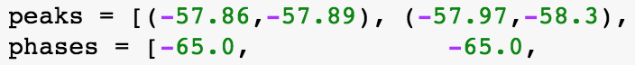
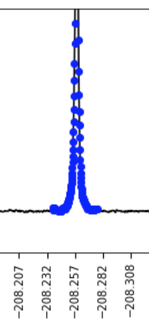
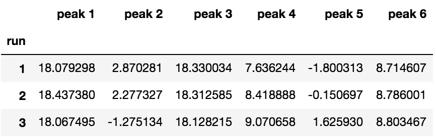
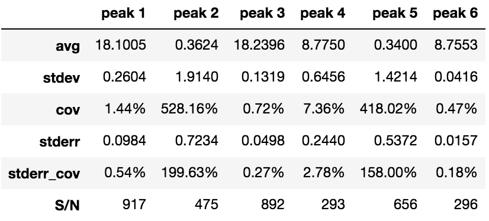

# Data Processing

*Python code for processing the raw NMR data from KIE experiments.*

This directory contains [template Jupyter notebooks](./notebooks) for processing raw NMR data and a step-by-step tutorial for how to use them.  You may wish to copy the [tutorial notebook](processing_tutorial.ipynb) and the [example spectra](./tutorial_data) to another folder before playing with them.

## Introduction

The goal of the NMR methods described here is to measure the small changes in fractionation when a reaction occurs.  Because these effects are so subtle, we need an accurate method that can process the NMR spectra reproducibly.  This software pipeline is designed to accomplish this as efficiently as possible.

Even though we are offering several different NMR methods for measuring KIEs here, almost the same procedure is used for each kind of experiment.  The example below considers the processing of MQF data.

## Required Files

For this tutorial, you will need:

* the raw data folder (`tutorial_data/`, which contains `tutorial_MQF_1.fid/` and `tutorial_MQF_2.fid/`)
* the Jupyter notebook (`processing_tutorial.ipynb`)

If you want to process other kinds of experiments, template notebooks are provided in the `notebooks/` folder:

* `DEPT.ipynb`: quantitative 13C NMR or DEPT
* `MQF.ipynb`: MQF
* `fluorine.ipynb`: routine 19F NMR
* `proton.ipynb`: routine 1HH NMR

(Incidentally, these notebooks can be easily adapted to process data from NMR kinetics.)

Our processing notebooks are designed to work with NMR data acquired on Varian/Agilent machines. Each `.fid/` folder contains of four files; the free induction decay (`fid`) file, the parameters (`procpar`), the experiment log (`log`), and an auxiliary notes file (`text`). The `fid` and `procpar` files are esssential to the analysis. 

*Note: The [nmrglue](https://www.nmrglue.com/) package is compatible with other systems.  Consult the nmrglue documentation to see how to import other file formats.*

## Overview 

This is a general overview of the processing pipeline.  Further details are provided in the notebook itself.  Open Jupyter notebook (using the folder that contains `processing_tutorial.ipynb` as the working directory) to follow along.

**Step 1: Import Libraries**

  All processing notebooks begin with a block of code for loading in necessary libraries and functions. These include [pandas](https://pandas.pydata.org/), [numpy](http://www.numpy.org/), [matplotlib](https://matplotlib.org/), and [nmrglue](https://www.nmrglue.com/). 

**Step 2: Raw Data Import**

  The next step is to convert the NMR data from its native format into NumPy arrays.  In many cases, the NMR data are split across many files, so we use `glob` to retrieve data from multiple files with wildcards:
  
  `filenames = glob.glob("*MQF*.fid")`
  
  This line does the actual importing:
  
  `dic, FIDs = ng.varian.read(filename)`
  
  The NMR data are loaded into two structures; a dictionary (`dic`) containing the acquisition parameters, and `FIDs` that contain the actual data.
  
**Data Organization**

  In your own analyses, you should create a new processing notebook for each NMR experiment.  We recommend creating folders for each different acquisition date.  Within these folders, save both the raw NMR data and the associated Jupyter notebook.  This will allow others to verify your analyses later.

**Step 3: FID Processing**

  The FID data require Fourier transformation to generate spectra.  Several processing steps are required:

  * **Apodization**

    `pdic, pdata = ng.pipe_proc.em(pdic, pdata, lb=0.25)`

    We use exponential multiplication (aka. line broadening) to reduce truncation (aka. "sinc") wiggles at the base of each peak.  Experience has shown the results are not very sensitive to the amount of apodization.  More exponential multiplication results in higher S/N, but does not reduce the variance in the integrals by very much.
  
  * **Zero Filling**

    `pdic, pdata = ng.pipe_proc.zf(pdic, pdata, size=4*npoints, auto=True)`

    Zero filling is the addition of zeroes to the end of the time domain.  This also has the effect of reducing wiggles by increasing the number of Fourier coefficients.  `auto=True` rounds to the nearest power of 2, to allow use of the fast Fourier transform.  Note that using a very large `size` will slow down the calculations considerably.
  
  * **Fourier Transformation**

    `pdic, pdata = ng.pipe_proc.ft(pdic, pdata)`
    
    This projects the data onto the Fourier basis to create the spectrum.  Note that both the real and imaginary parts of the spectrum are retained.
  
  * **Linear Phase Correction**

    `pdic, pdata = ng.pipe_proc.ps(pdic, pdata, p0=202, p1=0)`

    If this is your first time loading the data, the spectrum will probably look very strange.  But don't panic!  The phasing just needs correcting.  The key parameters to adjust are the phases `p0` and `p1`.

    1. Visualize the spectrum with arbitrary phases.  `plt.xlim` and `plt.ylim` can be adjusted to display the entire spectrum at a reasonable scale.  Set the x-axis so larger frequencies are on the <u>left</u> (recall that this is the convention for chemical shifts).
    
    2. Adjust `p0` so that a peak on the right-hand part of the spectrum is purely absorptive (i.e., "up").
    
    3. Adjust `p1` so that the peaks on the left-hand part of the spectrum are purely absorptive.

    4. Adjust `p0` and `p1` further until satisfactory results are obtained.  Generally, if a peak is too low on the right, it needs to be phased less.  Note that increasing `p1` will generally require lowering `p0` (the reason is explained below).

    5. In some cases, it will not be possible to get all the phases right from a linear phase correction alone.  Additional fine adjustments will be made later.
    
    *Technical Details:* The spectrum is multiplied by a linear phase function.  `p0` is the constant part of the phase and `p1` is the linear part of the phase.  From the `nmrglue` code base:
    
    `np.exp(1.0j * (p0 + (p1 * np.arange(size) / size))`
                  
    In English, we are multiplying the complex spectrum by exp(i&phi;), where &phi;=`p0` + `p1` x (position in spectrum).  The left edge of the spectrum is defined to have a position of 1 and the right edge of the spectrum is defined to have a position of 0.  Hence, increasing `p1` will increase the phase more on the left of the spectrum than the right.  If the peaks at the right edge are already absorptive, then increasing `p1` will over-compensate, requiring `p0` to be lowered.
    
    Note that if `p1` is very large, then `p1` x (position in spectrum) can traverse more than 2&pi; as the position is increased from 0 to 1, resulting in a rolling baseline. 
   
**Step 4: Referencing**
   
`ppm = ppm - ppm[-1] - 239.5251`
   
 The default chemical shift scale from `nmrglue` seems to be arbitrary.  Adjust the constant shown above to correct the scale.

**Step 5: Define Peaks and Fine Phase Adjustment**

  * **Define Peaks**

  The `peaks` list allows you to define the integration region for each peak.  Aim to integrate a region that places the highest point of the peak in the center.  If peaks change chemical shift slightly between samples, adjust the referencing first.  If that isn't enough, you can move the integration region left or right as necessary, as long as you don't change its width.  Note that you must place the larger chemical shift as the first number.
  
  * **Peak Highlighting**

    

    You can use the next cell to highlight the peak integration region in blue.  Useful parameters:
  
    * `spectrum_number`: selects a spectrum from a particular run.
    * `peak_number`: which peak to highlight (indexed from zero)
    * `x_axis_range`: how wide of a region to display
    * `plt.ylim`: the zoom level of the plot

  * Fine Phase Adjustment

  The `phases` list allows you to perform additional phasing.  Zero-order phasing is applied across the integration region (i.e., the same phase across the peak).  You may want to check that your phase correction works well for spectra across the entire experimental run.

**Step 6: Baseline Correction**

`def compute_baseline(spectrum, `**`order=2,`**` clip_below = -60000, clip_above = 60000, plot=False):`

Regions that are not within peaks are defined to be part of the baseline.  In this step, we fit a polynomial of order 2 (i.e., a parabola) to the baseline of each spectrum.  This baseline is then subtracted from the overall spectrum.  Use the lowest order polynomial that adequately represents the baseline.
  
The `clip_below` and `clip_above` parameters will ignore any parts of the baseline that are above or below the given values.  This helps prevent any outliers (or unpicked peaks) from skewing the baseline.  Be sure to check these parameters, or the baseline might not be fit properly!  You can visualize the baseline for each spectrum by setting `plot=True` (can be slow).
  
**Step 7: Calculate S/N**

  `def compute_signal_to_noise(spectrum, noise=(-95.00, -100.00), plot=False):`

This code calculates the S/N ratio for each peak.  The signal level is defined as the maximum intensity in the baseline-subtracted peak region divided by 2.  The noise level is defined as the root-mean-square average of the baseline-subtracted noise region (`-95.00,-100.00` in this example).

**Step 8: Integrate Peaks**

Running the next few cells will automatically integrate the spectra.  This summary table shows the integals for each complete phase cycle.  You may want to plot the integrals over time to ensure there are no outliers or drift.

**Step 9: Collect Summary Statistics**

  The final table of output shows a summary of all the key information for KIE calculation; specifically the average integrals over the whole acquisition, some associated statistics, and signal to noise ratios.

## Pulse-Sequence-Specific Considerations

* **DEPT**

  - Linear phase correction should be sufficient for most spectra.
  - Small fine phase adjustments may be necessary for spectra covering a wide chemical shift range.

* **MQF**
  - Each satellite peak will appear as an antiphase doublet (i.e., one peak will be up and one will be down).  Thus, use fine phase adjustment to invert the negative peaks.
    - Adding or subtracting 180&deg; from the phases will invert the peaks.
  - Linear phase correction will not be able to adjust all the phases.  Use `p0` only and use fine adjustment to correct any remaining errors.
  - The integral of the residual 12C&ndash;19F peak is not useful for the KIE analysis, but can indicate the efficiency of suppression.
  - The undesired parent peaks should always be included in the `peaks` array so that they are excluded from the baseline calculation.
  - Because the presence of a 13C isotope changes the 19F chemical shift, the averaged center of the satellites is not the same as the center of the parent peak.

* **19F**
  - Careful phasing of the reference peak is essential for accuracy.
  - The baselines often contain slow oscillations.  Ensure the baseline correction accurately captures these oscillations for best results.
  - Fine phase adjustments are generally not required.

* **1H**
  - Careful phasing of the reference peak is essential for accuracy.
  - These spectra often require very little `p1` phase correction and should require no fine phase adjustments.
