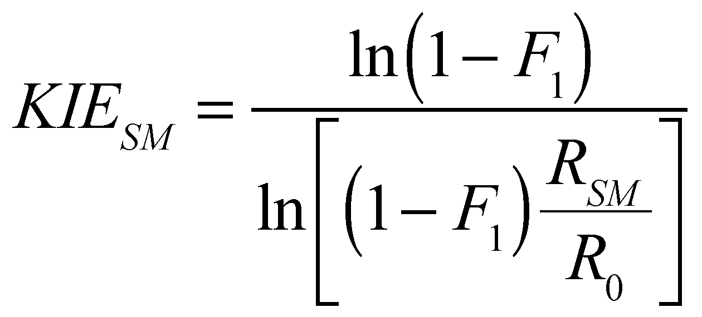
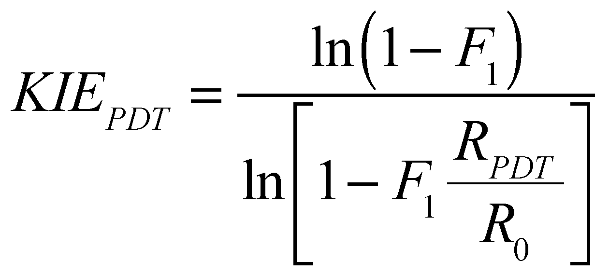

# PyKIE

*Python-based tools for measuring <sup>12</sup>C/<sup>13</sup>C kinetic isotope effects (KIEs) at natural abundance using NMR spectroscopy.*

## Contents

Quick Start | [Getting Started](#getting-started) | [Installation](#installation) | [System Requirements](#system-requirements) |
--- | --- | --- | ---
**Background** | [Introduction](#introduction) | [How do KIE Measurements Work?](#how-do-kie-measurements-work)
**How It Works** | [NMR Methods](#nmr-methods) | [Experimental Workflow](#experimental-workflow) | [Error Analysis](#error-analysis) 
**Tutorials** | [Data Acquisition](Data_Acquisition/README.md) | [Data Processing](Data_Processing/README.md) | [Data Analysis](Data_Analysis/README.md)
**Fine Print** | [References](#references) | [Getting Help](#getting-help) | [How to Cite](#how-to-cite)


## Introduction

PyKIE is a software package for measuring <sup>12</sup>C/<sup>13</sup>C kinetic isotope effects (KIEs) at natural abundance using NMR spectroscopy.  It relies on the Python programming language (hence the name).  There are three main software components:

- pulse sequences (Varian/Agilent, see [below](#system-requirements) for details)
- a pipeline for measuring fractionation factors from NMR spectra ([Jupyter](http://jupyter.org/) notebooks)
- formulas for calculating KIEs and errors from fractionation factors (Excel spreadsheet)

The documents contained here will explain every step of this process.  We do *not* assume you know how to code!

## How do KIE Measurements Work?

We rely on the following:

* At natural abundance:
  * Most carbons (~98.9%) are carbon-12.
  * Some carbons (~1.1%) are carbon-13.
  * The true proportion depends on exactly how the molecule was synthesized, since each step is subject to a KIE.
 
* If carbon-13 is present at (or near) the site undergoing reaction, the rate of reaction will usually be slightly slower (by up to 5%).  This is called the KIE.

* At partial conversion:
  * The isotopologues will *compete*.
  * The faster isotopologue (usually containing carbon-12) will be enriched in the product.
  * The slower isotopologue (usually containing carbon-13) will be enriched in the remaining starting material.
* The degree of enrichment is measured by the **fractionation factor**:
  * Isotope ratio in unreacted starting material (**R<sub>0</sub>**): [<sup>12</sup>C]<sub>0</sub>/[<sup>13</sup>C]<sub>0</sub>
  * Isotope ratio in recovered starting material (**R<sub>SM<sub>**) or product (**R<sub>PDT**): [<sup>12</sup>C]/[<sup>13</sup>C]
  * Fractionation factor definition: **R/R<sub>0</sub>**

* To calculate the KIE:
  * Measure the fractionation factor at a particular conversion.
  * Define *F<sub>1</sub>* as the conversion of the lighter isotope (carbon-12).  Under normal circumstances, *F<sub>1</sub>* &asymp; *F* is a very good approximation.
  * For analyses based on recovered starting material:<br/>
  
  &nbsp;&nbsp;&nbsp;&nbsp;&nbsp;&nbsp;&nbsp;&nbsp;
  
  * For product analyses:<br/>
  
  &nbsp;&nbsp;&nbsp;&nbsp;&nbsp;&nbsp;&nbsp;&nbsp;
  
  * For derivations, see the classic book by Melander and Saunders.<sup>1</sup>

## NMR Methods

* Quantitative <sup>13</sup>C NMR:
  * In 1995, Singleton showed that this method can be used to measure fractionation factors at natural abundance.<sup>2</sup>
  * Since NMR gives site-specific information, this breakthrough made it possible to measure carbon KIEs *at every position in a molecule simultaneously*.

* However, quantitative <sup>13</sup>C NMR suffers from several drawbacks that limit sensitivity:

  * the small gyromagnetic ratio of <sup>13</sup>C (1/4 relative to <sup>1</sup>H), which means that the signal comes from a smaller population of excess spins
  * the slow relaxation time of <sup>13</sup>C, which limits the number of scans

* Additionally, all methods must contend with:

  * the low abundance of <sup>13</sup>C (1.1%), which means most of the sample does not contribute to the observed signal
  * the requirement that the reaction be run to low (e.g., 10%) or high (e.g., 90%) conversion, which reduces the amount of material available for analysis

This means that hundreds of mg and days of NMR time may be required for precise measurements.  Here, we offer several alternative methods that offer better performance in many situations.  These methods decrease the amount of material required, sometimes dramatically, making it feasible to measure KIEs in complex reactions where the reagents or reactants are precious.

This chart will help you decide which method is best for your situation:

Method | Excited Nucleus | Detected Nucleus | Advantages | Disadvantages | Relative Sensitivity | Ideal Use Case
--- | --- | --- | --- | --- | --- | ---
quantitative <sup>13</sup>C | <sup>13</sup>C | <sup>13</sup>C | detects all carbon types | low sensitivity | 1.0 | quaternary carbons
DEPT<sup>3</sup> | <sup>1</sup>H | <sup>13</sup>C | widely installed, fast relaxation | protonated carbons only | 4.0 | general purpose
MQF<sup>4</sup> | <sup>19</sup>F | <sup>19</sup>F | very sensitive, unaffected by impurities | fluorine only | 13.6 | fluorination reactions

For example, DEPT has a sensitivity of 4 relative to quantitative <sup>13</sup>C NMR.  This means that 1/4 the amount of material would be required to reach the same signal to noise (S/N) in the same acquisition time.  Alternatively, 1/16<sup>th</sup> the amount of acquisition time would be needed to reach the same S/N using the same amount of material (because S/N ~ scans<sup>0.5</sup>).  Note that this analysis does not factor in the faster relaxation times of <sup>1</sup>H, which can lead to substantially faster experiments.  In general, the repetition time (the time between scans) depends on the T<sub>1</sub> relaxation time of the excited nucleus.

Additional methods are currently under development and will be posted here in due course.

## Experimental Workflow

This section discusses the typical considerations for designing a KIE experiment.

1. **Select a Reaction**

  * *Will the KIE be informative?*  

  At a minimum, the carbon label should be at or adjacent to the reaction site of interest.  Additionally, the mechanistic possibilities under consideration should be predicted (at least qualitatively) to give different KIEs.
  
  * *Does the reaction cleanly form a single product?*
  
  If the reaction generates a significant proportion of side-products (>5%), the true KIE will be confounded by the KIEs from all the side reactions, and therefore, KIE analysis is not advisable.  (Additionally, NMR measurements are sensitive to baseline contaminants.)  If a well-defined mixture of products is formed, analysis is still possible, but becomes more challenging.<sup>5</sup>

2. **Sample Preparation**

  Samples should be prepared consistently so that the response factors remain constant.
  
  (The response factor is the constant of proportionality between the size of the observed signal and the concentration of the sample.  All of these KIE analyses assume that the response factor does not change from sample to sample.  See reference 3 for a more detailed discussion.)
  
  * *NMR Tubes*
    
    The quality of the tube seems to make very little difference.  We have used high-quality Wilmad 528-PP tubes and disposable NMR tubes with no apparent change in accuracy.  Nonetheless, use the same NMR tube type for all experiments.
    
  * *Concentration*
  
    It is crucial for the concentration in each sample to be exactly the same.  Differing concentrations can affect chemical shifts or even peak shapes, and hence, response factors.
  
  * *Sample Height*

    Similarly, prepare each sample to the same height (i.e., use the same volume as well as concentration).  In standard 5 mm tubes, a 5 cm height is optimal (ca. 600 &micro;L).  This minimizes problems with shimming (and therefore lineshape).
  
  * *Sealing Samples*

    It is a good idea to flame seal each NMR sample.  Sealing prevents evaporation, which can change concentrations.  (Some acquisitions can take days.  Alternatively, this also allows acquisitions to be repeated later.)  For compounds that are not sensitive to air, sealing under atmospheric pressure is very convenient.
    
    To seal, clamp the NMR tube loosely and use a torch with a focused flame to heat up a small region of the NMR tube just below its opening.  (Sealing too low may shorten the tube too much, such that it no longer fits in the sample holder.)  Rotate the tube so that the heating is even.  When the glass softens, use tweezers to pull a small ring of glass upwards from the top.  The softened glass will collapse, sealing the tube.  If the seal leaves a sharp projection of glass at the top, applying the flame briefly to melt the projection down.  **Use proper personal protective equipment, and be extra careful if your NMR solvent is flammable!**
  
  * *NMR Solvent*

  Ensure the NMR solvent clearly resolves the peaks of interest.  (Chloroform-benzene mixtures can be useful.)  If you are using a solvent mixture, ensure that each sample is prepared from the same stock of solvent mixture.

  * *Relaxation Agents*

  We have found that adding a small amount of the well-known paramagnetic relaxation agent Cr(acac)<sub>3</sub> can reduce the T<sub>1</sub> relaxation times significantly without increasing the linewidth by very much.  The effect is more pronounced for nuclei on the exterior of the molecule like protons and fluorines.  Since DEPT and MQF generate signal from these exterior nuclei, they benefit greatly from this effect.
  
  We have noticed that once samples are sealed and left undisturbed for weeks, their T<sub>1</sub> times can increase significantly.  This is most likely due to the concentration of dissolved oxygen (which is paramagnetic) coming to equilibrium.  When the T<sub>1</sub> times vary across samples, using finite delays between scans introduces systematic errors.  When Cr(acac)<sub>3</sub> is added, these effects disappear.
  
  To find the optimal concentration of Cr(acac)<sub>3</sub>, measure the T<sub>1</sub> relaxation times (using inversion recovery) and linewidths of the peaks of interest for a series of chromium concentrations.  A linewidth of 10 Hz at half height is generally the upper limit, with less than 2 Hz being ideal.  Typically, concentrations of 0.5-2.0 mM Cr(acac)<sub>3</sub> work the best.

3. **Stability Check**

  It is good practice to check that the selected sample concentration and NMR method will lead to reasonable error bars.  This is easily done by repeatedly collecting spectra for a single sample.  This allows problems with low S/N or spectrometer instability to be addressed before a time-consuming KIE analysis is done.  Stability checks can be performed on unreacted starting material or full conversion product, so the cost in terms of synthesis is minimal.

  * Prepare a single NMR sample of the starting material or product that will be analyzed.
  * Ensure that all peaks have been unambiguously assigned.
  * Test the desired NMR method on the sample for several hours.  If a different experiment is being used to obtain the reference peak integral (see below), test that experiment as well.
  * Process the data and ensure the coefficient of variance (COV) is acceptable.  Ideally, the COV should be below **1%**.  Values of **3%** or higher are unacceptable. (These values assume integrals are being averaged over groups of 32 scans.)
  * The COV generally correlates with signal to noise (S/N).  (The Python processing pipeline will calculate S/N automatically.)  However, the correlation is not exact: for example, increasing the degree of line broadening will increase S/N, but generally does not affect the COV.
  * Plot the integral of each peak vs. time.  There should be no discernable trend and a histogram should be roughly normally distributed.  Drift may indicate spectrometer instability, while outliers may suggest a transient artifact in the power supply.

4. **Fractionation**

  To ensure the response factors are kept exactly the same between measurements, it is important that the same compound be quantitated in every sample.

  * *Starting-Material-Based Analysis*
  
  The partial conversion sample is recovered starting material.  The initial isotopic ratio is measured on unreacted starting material.

  * *Product-Based Analysis*

  The partial conversion sample is product.  The initial isotopic ratio is *also* made on product, by carrying a reaction to 100% conversion.  At complete conversion, the isotopic composition of the product must match that of the reactants.
  
  Note that the reaction used to generate full conversion product need *not* be the same as the reaction used to generate the partial conversion product.  This trick can be handy when the reaction of interest cannot be taken to 100% conversion.
  
  * *Replicates*

  As discussed [below](#error-analysis), use (at a minimum) two partial conversion samples and two zero/full-conversion samples taken from independent chemical reactions.

5. **Data Acquisition**

  See the experiment-specific protocols for the details of how to setup each NMR experiment.  When using our improved NMR methods, the amount of carbon-12 and carbon-13 will be measured in different acquisitions.  For example, one might measure the amount of carbon-13 using an MQF experiment, and then the amount of carbon-12 in a standard fluorine experiment.  Because the sensitivity of the standard fluorine experiment is much greater, most of the experimental time should be spent on MQF acquisition.  Our standard protocol is to schedule the standard fluorine experiment for the middle of the data acquisition.
  
  Additionally, signal averaging is used to both improve the precision of the mean integral (of carbon-12 or carbon-13) and estimate the standard error of the mean.  Our standard protocol is to consider each spectrum to be the sum of 32 individual scans (for DEPT or MQF) or 4 individual scans (for standard proton or fluorine experiments).  These numbers constitute a complete phase cycle.
  
  As discussed [below](#error-analysis), for extended acquisition times (more than overnight), use randomized blocking to account for spectrometer drift and other sources of error.

6. **Data Processing**

  Please see the tutorial on how to use our Python pipeline to perform data processing.  You can view the Jupyter notebook (`.ipynb`) on GitHub directly, or open it locally.  To do the latter, [open Jupyter notebook](http://jupyter-notebook-beginner-guide.readthedocs.io/en/latest/execute.html) and make a copy of the tutorial notebook.  If you can't find the file, check the Jupyter working directory.
  
  Press `shift-enter` to evaluate each cell.  The output for each group of commands will be displayed below each cell.
  
  We generally keep one notebook for each sample.  (The tutorial will explain how to combine data for acquisitions that are spread over multiple blocks.)  This provides a traceable log of exactly how the data were processed.

7. **Data Analysis**

  Please see the tutorial on how to use our Excel notebooks.  The general strategy is to copy the mean integral value (and its standard deviation) from each Jupyter notebook into Excel, and calculate the KIEs and error bars there.
  
  As you can see, the process of obtaining a KIE is a fairly complicated one, and often generates a large amount of data.  It is a very good idea to keep the raw NMR data, Jupyter notebooks, and Excel sheets in one organized directory for later reporting.  It is also helpful to keep some notes on the exact experimental parameters that were used.

8. **Calculations**

  Once you have obtained your KIE, it is time to interpret it!  A discussion of how to do this is beyond the scope of this document, but the general strategy is to make *ab initio* or DFT models of your reaction and compare the experimental and predicted isotope effects.  The [PyQuiver](http://github.com/ekwan/PyQuiver) package is designed to be a user-friendly way to generate KIE predictions from Gaussian calculations.  See our work (referenced below) and the enormous body of work by our friend Professor Singleton (Texas A&M) for examples of how to perform these kinds of analyses.

## Error Analysis

To make sensible comparisons between theory and experiment, it is important to estimate the degree of uncertainty in the measurement.  Errors can come from many sources.

**Chemical variations** are changes in fractionation when a chemical reaction is repeated due to:

 - changes in reagent purity
 - accuracy of reagent stoichiometry
 - temperature fluctuations (KIEs generally decrease with increasing temperature)
 - *(...and many more)*

To mitigate these errors, it is **best practice** to determine KIEs on a *minimum of two independent chemical replicates*:
  
  * *Starting-material-based analyses*: The reaction should be carried to partial conversion twice in two independent reactions.  The fractionation should be measured by comparing two samples of the unreacted starting material with the two partial conversion samples.  Fractionation data for the unreacted starting material can be pooled to give two independent KIE measurements.
  
  * *Product-based analyses*: The reaction should be carried to full conversion twice, and partial conversion twice, for a total of four samples.  Fractionation data for the full conversion materials can be pooled to give two independent KIE measurements.

  * As a rule of thumb, the two KIE measurements should agree to within 0.003.  If they don't, consider checking the experimental design more carefully and making more measurements.

  * In both cases, the **same batch** of starting materials should be used for all reactions and analyses.  This avoids confounding the measurement of fractionation with natural variations in isotopic composition.  All other variables (temperature, solvent, sources of reagents, operator, etc.) should also be kept the same to minimize any [batch effects](http://dx.doi.org/10.1038/nrg2825).

**Technical variations** are inaccuracies in the determination of fractionation due to errors in measuring:

   * **Conversion**
     * Starting-material-based analyses are generally more sensitive to errors in conversion than product-based analyses are.
     * A precision of &plusmn;1% (starting material) or &plusmn;5% (product) is generally sufficient.
   * **Fractionation**
     * **Within-Run Errors** are variations caused by baseline noise.  Acquiring many spectra for each sample reduces these errors through averaging.  Additionally, integrating a sufficiently wide region centered around each peak of interest is important for capturing an accurate integral.  The width of the integration region for each peak should be kept consistent between samples, although the center of the integration region can be adapted for slight variations in chemical shift.
     
     * **Between-Run Errors** are due to the particulars of how the NMR experiments are set up for each sample (e.g., shimming, sample positioning, temperature fluctuations, etc.).  Over long acquisition times, spectrometer drift can also contribute to this kind of error.  To minimize these erros, leave all spectrometer settings (pulse widths, spectral windows, etc.) unchanged between samples and try to minimize the total amount of spectrometer time.

To reduce between-run errors, it is a good idea to employ **randomized blocking**.  For example, consider an experiment in which spectra are needed for two full conversion samples (F1 and F2) and two partial conversion samples (P1 and P2).  Instead of simply acquiring the spectra one after another, randomized blocking would entail collecting the four spectra several times, each in a different order.

Python is convenient for generating such randomized schedules.  For example:

```python
>>> import random
>>> x = ["F1","F2","P1","P2"]
>>> random.shuffle(x)
>>> x
['F1', 'P1', 'F2', 'P2']
>>> random.shuffle(x)
>>> x
['P1', 'F2', 'F1', 'P2']
```

Thus, we would collect spectra in the order F1, P1, F2, P2, P1, F2, F1, P2.  Sometimes, this might lead to the same sample appearing twice in a row.  In such cases, simply remove the sample from the spectrometer and re-insert it, and set up the experiment as you normally would.

The Excel notebooks included in this repository include formulas<sup>&dagger;</sup> that will estimate the uncertainty<sup>&Dagger;</sup> of the KIE measurement due to the measurement of conversion and technical variations.  This provides a lower bound for the overall error.  However, when the S/N is very high, chemical variations and between-run technical variations will dominate the overall error.  This means that increasing the acquisition time beyond the point where the standard error of the mean KIE drops below ~0.003 is counterproductive.

<sub><sup>&dagger;</sup>Formulas are based on standard error propagation and the *t*-distribution.</sub><br/>
<sub><sup>&dagger;</sup>A KIE measurement of 1.010(3) means that we estimate a 68% chance that the true KIE lies within the interval 1.007&ndash;1.013.</sub>

## Getting Started

1. Read this document and install the necessary software.
2. Run through the [data processing](Data_Processing/README.md) and KIE calculation tutorials.
3. Read the document on experimental design and collect some test spectra.
4. Measure your KIE!
5. Compare your experimental KIE to predicted KIEs using [PyQuiver](http://github.com/ekwan/PyQuiver).

## System Requirements

*Data Acquisition*

* NMR spectrometer (Varian/Agilent is directly supported, other systems will require work)
* <sup>13</sup>C-optimized NMR probe (aka. "direct detection," for quantitative <sup>13</sup>C NMR and DEPT)
* <sup>19</sup>F-optimized NMR probe (with 3-channel H/F/C console, for MQF)

*Data Processing*

* Python 2 and standard Anaconda dependencies (see below)
* NMRglue (package for processing NMR data)

*Calculating KIEs*

* Microsoft Excel

## Installation

1. **Download Files**

 * If necessary, [install git](https://git-scm.com/book/en/v2/Getting-Started-Installing-Git).
 * Clone this repository (i.e., copy the PyKIE files to you computer): `git clone https://github.com/ekwan/PyKIE.git`

2. **Install Pulse Sequences**

 *Note*: These instructions are specific to Agilent/Varian spectrometers running VNMRJ 3 or later.  If you are performing quantitative <sup>13</sup>C NMR or DEPT, the sequences on other systems should work "out of the box."  If you want to run MQF or SQUASH, please [contact us](#getting-help) and we will help you adapt our methods to your system.
 
 For a desired pulse sequence:
 
  - Copy the pulse sequence code (`sequence.c`) into `~/vnmrsys/psglib`.  Compile it: `seqgen sequence.c`.  (Replace `sequence` with the appropriate filename.)
  - Copy the pulse sequence parameter directory (`sequence.par/`) into `~/vnmrsys/parlib`.
  - Copy the pulse sequence macro (`sequence`) into `~/vnmrsys/maclib`.  The sequence may now be accessed in the usual way (i.e., by typing `sequence` at the VNMRJ command line prompt).
  - This procedure can be repeated for the various provided pulse sequences.

3. **Install Python and Dependencies**

 Data processing is done in the [Python 2](https://www.python.org/) programming language.  Downloading the [Anaconda distribution](https://www.anaconda.com/download/) will satisfy the following dependencies:

 * [Jupyter Notebook](http://jupyter.org/) (programming environment) 
 * [NumPy](http://www.numpy.org/) (data manipulation)
 * [pandas](https://pandas.pydata.org/) (data tabulation and statistics)

 You will also need to install [NMRglue](https://www.nmrglue.com/) to process NMR data.  You can either [download the binaries](https://github.com/jjhelmus/nmrglue/releases) or clone the [git repository](https://github.com/jjhelmus/nmrglue) and run `python setup.py install`.

4. **Excel Notebook**

 * If necessary, install Microsoft Excel.
 * Ensure that the tutorial notebook opens successfully.
 
## The Fine Print

### References

1. Melander, L.; Saunders, W.H. Jr.  <u>Reaction Rates of Isotopic Molecules.</u>  *Wiley*, **1980**.
2. Singleton, D.A.; Thomas, A.A.  [High-Precision Simultaneous Determination of Multiple Small Kinetic Isotope Effects at Natural Abundance.](https://pubs.acs.org/doi/abs/10.1021/ja00141a030)  *J. Am. Chem. Soc.*  **1995**, *117*, 9357&ndash;9358.
3. Kwan, E.E.; Park, Y.; Besser, H.A.; Anderson, T.L.; Jacobsen, E.N.  [Sensitive and Accurate <sup>13</sup>C Kinetic Isotope Effect Measurements Enabled by Polarization Transfer.](https://pubs.acs.org/doi/abs/10.1021/jacs.6b10621)  *J. Am. Chem. Soc.* **2017**, *139*, 43&ndash;46.
4. Kwan, E.E.; Zeng, Y.; Besser, H.A.; Jacobsen, E.N. <u>Concerted Nucleophilic Aromatic Substitutions.</u>  *Nature Chem.*  **2018**, accepted.
5. Xiang, S.; Meyer, M.P.  [A General Approach to Mechanism in Multiproduct Reactions: Product-Specific Intermolecular Kinetic Isotope Effects](http://dx.doi.org/10.1021/ja412827c).  *J. Am. Chem. Soc.*  **2014**, *136*, 5832&ndash;5835.
6. Smith, M.; Hu, H.; Shaka, A.J.  [Improved Broadband Inversion Performance for NMR in Liquids](http://dx.doi.org/10.1006/jmre.2001.2364).  *J. Mag. Reson.*  **2001**, *151*, 269&ndash;283.

### Getting Help

Please email Eugene Kwan at `ekwan16@gmail.com` with any questions.  We will gladly try to help you.

### Authors

*PyKIE* was written by Eugene Kwan and Harrison Besser at the Department of Chemistry and Chemical Biology at Harvard University.

The methods described here were developed with Thayer Anderson, Dr. Ron Ramsubhag, Dr. Yongho Park, and Dr. Yuwen Zeng under the supervision of Professor Eric Jacobsen.

We thank Dr. Shaw Huang and Mr. Bill Collins (Harvard CCB NMR Facility) for invaluable technical assistance during the development of these methods.  We also thank Professor William F. Reynolds and Dr. Darcy Burns from the University of Toronto for many helpful discussions.

### How to Cite

Kwan, E.E.; Besser, H.A. &nbsp; *PyKIE*. &nbsp; **2018**, `www.github.com/ekwan/PyKIE`.

### License
   
This project is licensed under the Apache License, Version 2.0. Please see `LICENSE.txt` for full terms and conditions.
   
*Copyright 2018 by Eugene E. Kwan and Harrison A. Besser*
